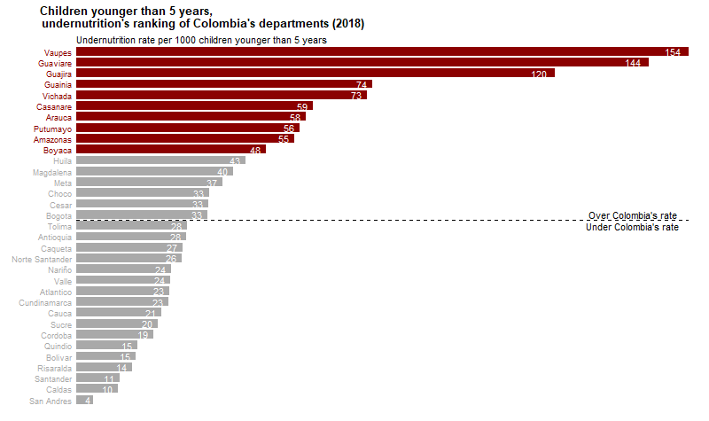

# Colombian children undernutrition 2018 plot

## Description
The aim of this project was to compare the undernutrition's rates of children younger than 5 years old in each colombian "departamento" for 2018.

## Data source
1.**Demographic data**: were taken from the last [national census of colombia in 2018](http://microdatos.dane.gov.co/index.php/catalog/643/get_microdata).
2.**Cases data** were taken from [the colombian survelliance system (SIVIGILA)](http://portalsivigila.ins.gov.co/Paginas/Buscador.aspx). I used the cases reported in 2018.

## Files' description
